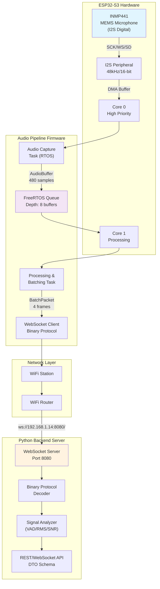
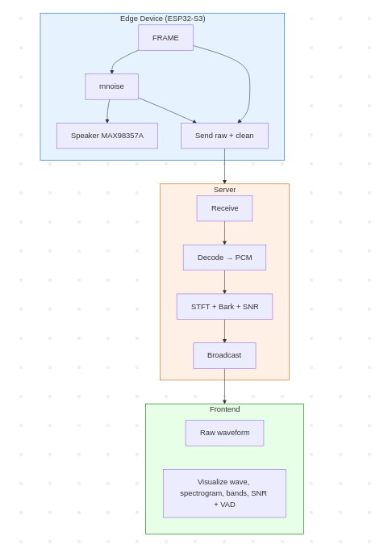
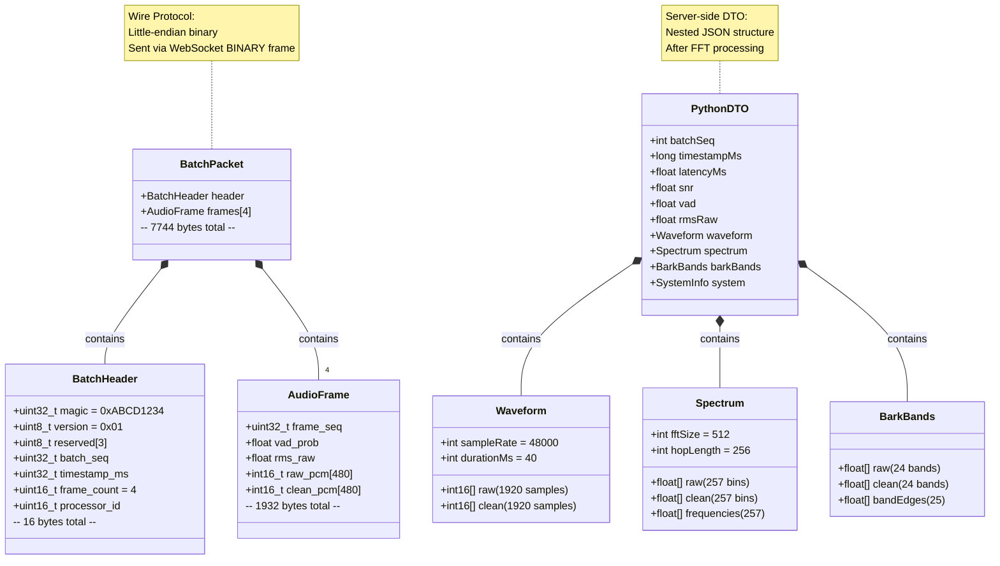
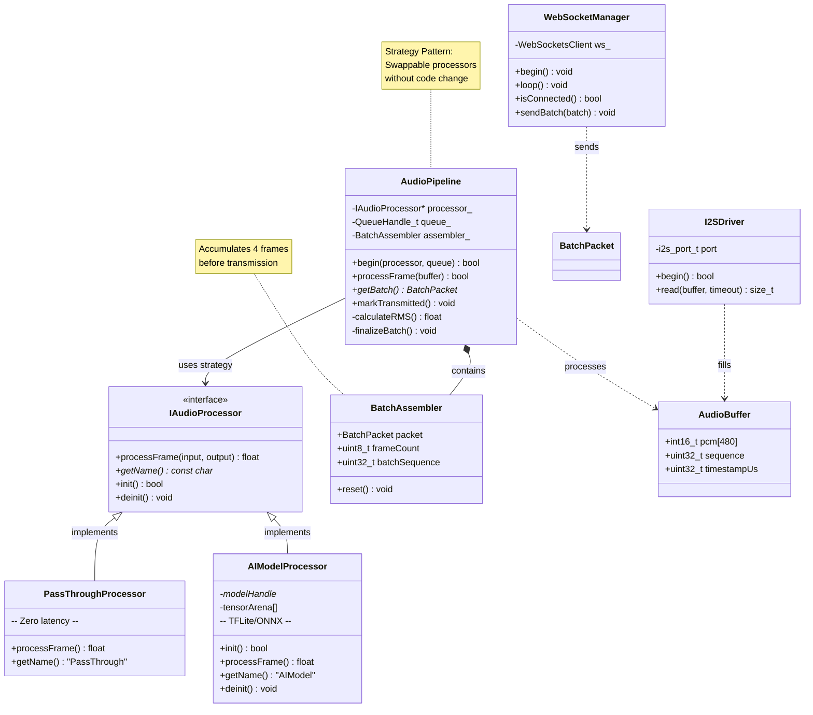
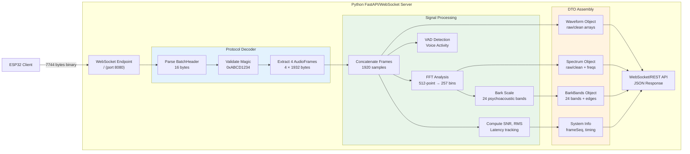

<!-- <video src="./assets/v.2.1.1.mp4" width="1280" height="720" controls></video> -->

## 1. System Architecture Overview



---

## 2. Data Flow & Pipeline Sequence

---





## 3. Binary Protocol Structure (Wire Format)



---

## 4. ESP32 Class Architecture (Strategy Pattern)



---

## 5. Python Server Architecture



---
## Payload Structure 

### 1. Batch Header (16 bytes)

| Offset | Field | Size | Value |
|--------|-------|------|-------|
| 0 | Magic Number | 4 bytes | `0xABCD1234` |
| 4 | Version | 1 byte | `0x01` |
| 5 | Reserved | 3 bytes | `0x00` |
| 8 | Batch Sequence | 4 bytes | Incrementing 0,1,2... |
| 12 | Timestamp (ms) | 4 bytes | Send time |
| 16 | Frame Count | 2 bytes | `4` |
| 18 | Processor ID | 2 bytes | Processor type |

---

### 2. Audio Frame (1932 bytes) × 4 frames

Each frame contains:

| Offset in frame | Field | Size | Description |
|-----------------|-------|------|-------------|
| 0 | Frame Sequence | 4 bytes | Frame sequence number |
| 4 | VAD Probability | 4 bytes | Float 0.0-1.0 (from AI) |
| 8 | RMS Raw | 4 bytes | Original audio intensity |
| 12 | Raw PCM | 960 bytes | **Original data** (480 samples × 2 bytes) |
| 972 | Clean PCM | 960 bytes | **AI-processed data** (480 samples × 2 bytes) |

---

### 3. Total Structure (7744 bytes)

```
┌─────────────────────────────────────┐
│         BATCH HEADER (16 bytes)     │
│  Magic | Version | Seq | Timestamp  │
├─────────────────────────────────────┤
│      FRAME 0 (1932 bytes)           │
│  Seq | VAD | RMS | Raw[480] | Clean[480] │
├─────────────────────────────────────┤
│      FRAME 1 (1932 bytes)           │
│  (same as frame 0)                  │
├─────────────────────────────────────┤
│      FRAME 2 (1932 bytes)           │
├─────────────────────────────────────┤
│      FRAME 3 (1932 bytes)           │
└─────────────────────────────────────┘
        ↓
   WebSocket BINARY frame
   Sent in one transmission
```


## Example 

**Assume** you say "Hello" into the microphone:

| Field | Sample Value |
|-------|--------------|
| `raw_pcm` | [1205, 3021, -1500, 800, ...] ← Has background noise |
| `clean_pcm` | [1200, 3019, -1498, 802, ...] ← Noise filtered |
| `vad_prob` | 0.95 ← AI detected speech |

The server receives both formats to:
- **Listen to** `clean_pcm` (processed version)
- **Compare** with `raw_pcm` (evaluate AI quality)
- **Analyze** `vad_prob` (know which segments contain speech)


# Setup

## Prerequisites

### Hardware
- ESP32-S3 development board
- INMP441 I2S microphone module
- USB cable for programming

### Software
- [PlatformIO IDE](https://platformio.org/install/ide?install=vscode) (VS Code extension or CLI)
- Python 3.8+
- Node.js 18+ and npm

---

## 1. ESP32 Firmware

Copy and edit the configuration:
```bash
cp src/config.example.h src/config.h
# Edit src/config.h with your WiFi credentials and server IP
```

Build and upload to device:
```bash
# Via PlatformIO CLI
pio run --target upload

# Or use the Makefile shortcut 
make
```

Monitor serial output:
```bash
pio device monitor --baud 115200
```

---

## 2. Python Observability Server

Navigate to server directory and set up environment:
```bash
cd python-server/

# Create virtual environment
python -m venv .env

# Activate (Linux/Mac)
source .env/bin/activate

# Activate (Windows PowerShell)
# .env\Scripts\Activate.ps1

# Activate (Windows CMD)
# .env\Scripts\activate.bat

# Install dependencies 
pip install -r requirements.txt

# Start server
python server.py
```

Server runs on `ws://localhost:8080` by default.

---

## 3. React Visualization Client

Navigate to client directory and install dependencies:
```bash
cd audio-visualizer/

# Install dependencies
npm install

# Start development server
npm run start
```

Client opens at `http://localhost:3000`

